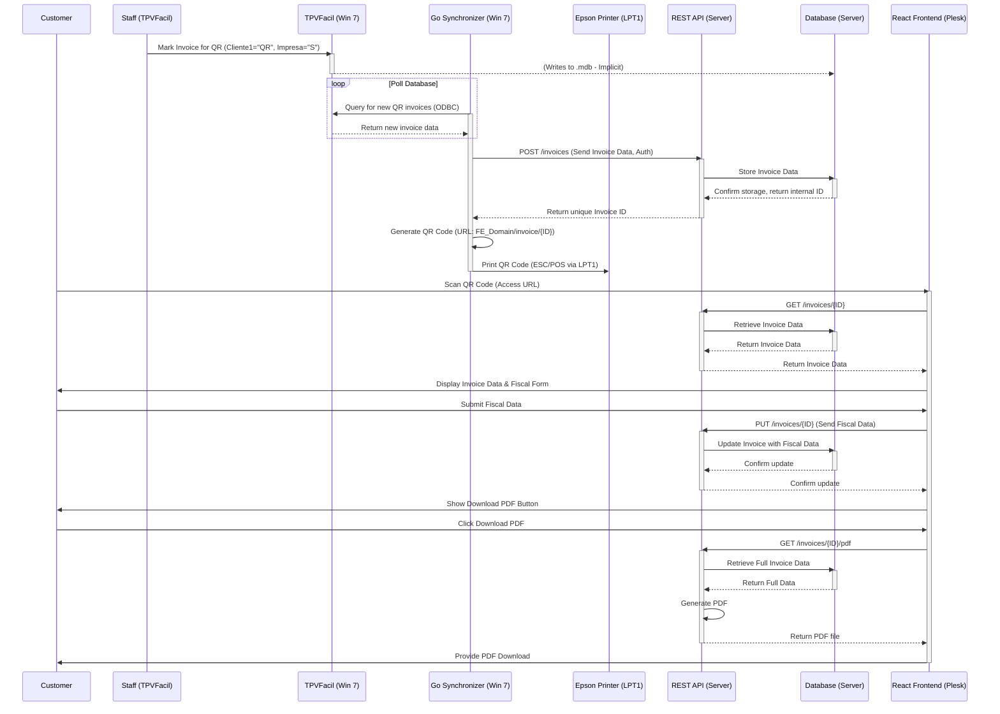

# Facturapid System Architecture

This document describes the architecture of the Facturapid system, detailing its components, interactions, data flow, and deployment strategy.

## 1. System Components

The Facturapid system comprises the following key components:

1.  **TPVFacil System (Existing):**
    *   **Environment:** Windows 7.
    *   **Role:** Point-of-sale system where invoices are initially generated.
    *   **Database:** Microsoft Access (`.mdb`) located at `c:\tpv\tpv.mdb`.
    *   **Interaction:** Source of invoice data; staff marks invoices for QR processing within this system.

2.  **Go Synchronizer (Backend Service):**
    *   **Environment:** Windows 7 (runs as a background service).
    *   **Role:** Monitors the TPVFacil database for new invoices marked for QR processing, extracts data, communicates with the REST API, generates a QR code, and prints it.
    *   **Technology:** Go.
    *   **Interactions:**
        *   Reads from the MS Access database (via ODBC).
        *   Sends invoice data to the REST API (via HTTPS POST).
        *   Receives unique invoice ID from the REST API.
        *   Generates a QR code image.
        *   Sends print commands to the Epson TM-T88 printer (via LPT1, using ESC/POS).

3.  **REST API (Backend Application):**
    *   **Environment:** Server (Linux recommended, hosting Go application and database).
    *   **Role:** Central hub for managing invoice data. Receives data from the synchronizer, stores it, handles updates with fiscal information from the frontend, and generates final PDF invoices.
    *   **Technology:** Go (using Gin, Echo, or Fiber framework).
    *   **Interactions:**
        *   Receives data from the Go Synchronizer (via HTTPS POST, authenticated).
        *   Stores and retrieves data from the Database (PostgreSQL/MySQL).
        *   Serves data to the React Frontend (via HTTPS GET).
        *   Receives fiscal data updates from the React Frontend (via HTTPS PUT).
        *   Generates and serves PDF invoices to the React Frontend (via HTTPS GET).

4.  **Database (Backend Storage):**
    *   **Environment:** Server (co-located or separate from the API server).
    *   **Role:** Persistent storage for invoice headers, line items, and customer fiscal data.
    *   **Technology:** PostgreSQL (preferred) or MySQL.
    *   **Interaction:** Accessed exclusively by the REST API.

5.  **React Frontend (Web Application):**
    *   **Environment:** Web server (hosted on Plesk).
    *   **Role:** Customer-facing interface accessed via QR code. Displays initial invoice details, allows customers to enter fiscal information, and enables downloading the final PDF invoice.
    *   **Technology:** React.
    *   **Interactions:**
        *   Accessed by the customer's browser via a unique URL.
        *   Fetches initial invoice data from the REST API (via HTTPS GET).
        *   Submits customer fiscal data to the REST API (via HTTPS PUT).
        *   Requests and receives the final PDF invoice from the REST API (via HTTPS GET).

6.  **Epson TM-T88 Printer (Existing Hardware):**
    *   **Environment:** Connected to the Windows 7 machine running the Synchronizer via LPT1.
    *   **Role:** Prints the QR code ticket for the customer.
    *   **Interaction:** Receives print commands (ESC/POS) from the Go Synchronizer via the LPT1 port.

## 2. Data Flow and Interactions

## 3. Communication Protocols

*   **Synchronizer <-> TPV Database:** ODBC over local connection.
*   **Synchronizer -> REST API:** HTTPS (POST requests with authentication - e.g., API Key).
*   **Synchronizer -> Printer:** ESC/POS commands via LPT1 port.
*   **REST API <-> Database:** Standard SQL connection (e.g., TCP/IP).
*   **Frontend <-> REST API:** HTTPS (GET, PUT requests).
*   **Customer Browser <-> Frontend:** HTTPS.

## 4. Deployment Strategy

*   **Go Synchronizer:** Deployed as a Windows Service on the same Windows 7 machine(s) running TPVFacil or having access to its database file and the LPT1 printer.
*   **REST API & Database:** Deployed on a separate server (Linux recommended for Go/PostgreSQL/MySQL). Can be hosted on-premises or in the cloud.
*   **React Frontend:** Static build files deployed to a web server managed by Plesk.

## 5. Key Considerations

*   **Windows 7 Dependency:** The synchronizer's reliance on Windows 7, ODBC for Access, and LPT1 port access are critical constraints and potential points of failure. Robust error handling and testing in this specific environment are paramount.
*   **Security:** HTTPS must be enforced for all API and frontend communication. Authentication between the synchronizer and API is crucial.
*   **Network:** Ensure reliable network connectivity between the Windows 7 machine (Synchronizer) and the server hosting the REST API.
*   **Scalability:** The REST API and database should be designed with scalability in mind, although the primary bottleneck might initially be the synchronizer's polling frequency and the TPV database performance.

